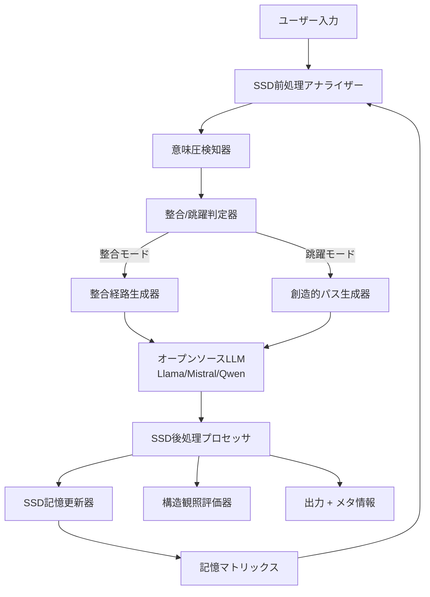

# SSD-LLM融合システム設計書

## 1. システム概要

### 1.1. プロジェクト名
**Structural Subjectivity Dynamics Enhanced Large Language Model (SSD-LLM)**

### 1.2. 目的
構造主観力学（SSD）の理論をオープンソースLLMに統合し、従来の「質問→回答」パターンを超えた、人間らしい学習・創造・適応能力を持つAIシステムを構築する。

### 1.3. 核心理念
- **整合と跳躍の両立**: 安定した応答と創造的な飛躍を動的に切り替え
- **継続的構造学習**: 会話を通じて応答パターンを改善
- **透明性のある意思決定**: SSDプロセスを可視化・制御可能

---

## 2. アーキテクチャ設計

### 2.1. システム全体構成



### 2.2. コアコンポーネント

#### A. SSD前処理アナライザー (SSD Preprocessor Analyzer)
```python
class SSDPreprocessor:
    def __init__(self):
        self.emotion_detector = EmotionAnalyzer()
        self.logic_complexity_meter = LogicComplexityMeter()
        self.value_alignment_detector = ValueAlignmentDetector()
        
    def analyze_meaning_pressure(self, user_input, context):
        return {
            'physical': self._detect_physical_constraints(user_input),
            'base': self._analyze_emotional_pressure(user_input),
            'core': self._assess_logical_demands(user_input),
            'upper': self._detect_value_involvement(user_input),
            'total_intensity': 0.0,  # 計算後設定
            'pressure_type': 'dominant_layer'  # 最も強い層
        }
```

#### B. 整合/跳躍判定器 (Alignment/Jump Decider)
```python
class AlignmentJumpDecider:
    def __init__(self, ssd_params):
        self.heat_level = 0.0
        self.kappa_matrix = SSDMemoryMatrix()
        self.threshold_calculator = DynamicThresholdCalculator()
        
    def decide_response_mode(self, meaning_pressure, context):
        # 既存経路での整合可能性チェック
        alignment_strength = self.kappa_matrix.get_alignment_strength(
            context, meaning_pressure
        )
        
        # 意味圧の処理可能性評価
        processing_capacity = self._calculate_processing_capacity()
        
        # 跳躍トリガー判定
        threshold = self.threshold_calculator.calculate_threshold(
            self.heat_level, alignment_strength
        )
        
        if meaning_pressure['total_intensity'] > threshold:
            self.heat_level += meaning_pressure['total_intensity'] * 0.6
            return 'leap'
        else:
            return 'alignment'
```

#### C. オープンソースLLM統合レイヤー
```python
class OpenSourceLLMIntegrator:
    def __init__(self, model_config):
        self.models = {
            'creative': self._load_model(model_config['creative']),
            'logical': self._load_model(model_config['logical']),
            'empathetic': self._load_model(model_config['empathetic'])
        }
        self.current_model = None
        
    def select_and_generate(self, prompt, mode, ssd_context):
        # SSDコンテキストに基づく最適モデル選択
        optimal_model = self._select_optimal_model(ssd_context)
        
        # 生成パラメータのSSD調整
        generation_params = self._calculate_ssd_parameters(mode, ssd_context)
        
        # 応答生成
        response = optimal_model.generate(prompt, **generation_params)
        
        return response, optimal_model.name
```

---

## 3. SSD核心機能詳細設計

### 3.1. Nano-SSD実装仕様

#### 基本状態変数
```python
@dataclass
class SSDState:
    kappa_matrix: Dict[str, float]      # 整合慣性 {pathway_id: strength}
    heat_level: float                   # 未処理圧E
    exploration_temp: float             # 探索温度T
    fatigue_level: float               # 疲労レベルF
    alignment_threshold: float          # 跳躍閾値Θ
    last_jump_timestamp: float          # 前回跳躍時刻
    
    # パフォーマンス指標
    alignment_efficiency: float         # 整合効率
    creativity_yield: float            # 創造歩留まり
    policy_entropy: float              # 政策エントロピー
```

#### ワンステップ更新アルゴリズム
```python
def ssd_update_step(self, user_input, context, dt=1.0):
    # === 整合ステップ（決定論的） ===
    meaning_pressure = self.analyze_meaning_pressure(user_input, context)
    alignment_flow = self.calculate_alignment_flow(meaning_pressure)
    
    # 学習・忘却の更新
    self._update_kappa_matrix(alignment_flow, meaning_pressure)
    
    # 未処理圧の更新
    self._update_heat_level(meaning_pressure, alignment_flow)
    
    # === 跳躍判定（確率論的） ===
    jump_probability = self._calculate_jump_probability()
    
    if random.random() < jump_probability:
        # 制約付きランダム接続
        new_pathway = self._generate_creative_pathway(context)
        self._execute_jump(new_pathway)
        response_mode = 'leap'
    else:
        response_mode = 'alignment'
    
    return response_mode, self.state
```

### 3.2. 記憶・学習システム

#### 整合慣性マトリックス
```python
class SSDMemoryMatrix:
    def __init__(self, max_pathways=1000):
        self.pathways = {}              # {pathway_hash: strength}
        self.success_history = {}       # {pathway_hash: [success_scores]}
        self.access_frequency = {}      # {pathway_hash: access_count}
        self.max_pathways = max_pathways
        
    def update_pathway_strength(self, context, response, feedback_score):
        pathway_hash = self._hash_context_response(context, response)
        
        # 新規経路の作成
        if pathway_hash not in self.pathways:
            self.pathways[pathway_hash] = 0.1
            self.success_history[pathway_hash] = []
        
        # 成功度に基づく強度更新
        if feedback_score > 0.7:
            self.pathways[pathway_hash] = min(0.95, 
                self.pathways[pathway_hash] + 0.05)
        elif feedback_score < 0.3:
            self.pathways[pathway_hash] *= 0.9
        
        self.success_history[pathway_hash].append(feedback_score)
        self._prune_weak_pathways()
```

### 3.3. 跳躍・創造システム

#### 制約付きランダム接続
```python
class CreativeJumpGenerator:
    def __init__(self):
        self.concept_graph = ConceptualGraph()
        self.constraint_checker = ConstraintChecker()
        
    def generate_creative_pathway(self, current_context, exploration_temp):
        # 候補概念の取得
        candidates = self.concept_graph.get_reachable_concepts(
            current_context, max_distance=3
        )
        
        # 制約チェック
        valid_candidates = [
            c for c in candidates 
            if self.constraint_checker.is_valid_connection(current_context, c)
        ]
        
        # 温度制御付きサンプリング
        probabilities = self._calculate_connection_probabilities(
            current_context, valid_candidates, exploration_temp
        )
        
        selected_concept = np.random.choice(valid_candidates, p=probabilities)
        return self._create_pathway(current_context, selected_concept)
```

---

## 4. 実装技術スタック

### 4.1. 推奨オープンソースLLM

| モデル | 用途 | メモリ要件 | 特徴 |
|--------|------|------------|------|
| **Llama 3.1 8B** | メインモデル | 16GB | バランス型、汎用性高 |
| **Mistral 7B** | 論理推論 | 14GB | 高効率、推論速度速 |
| **Qwen2.5 7B** | 多言語・創造 | 14GB | 創造性、日本語対応 |
| **Code Llama 7B** | コード生成 | 14GB | プログラミング特化 |

### 4.2. 技術スタック構成

#### 基盤フレームワーク
```yaml
# requirements.yml
foundation:
  - torch>=2.0.0
  - transformers>=4.35.0
  - accelerate>=0.20.0
  - peft>=0.6.0              # LoRA統合用

optimization:
  - bitsandbytes>=0.41.0     # 量子化
  - optimum[onnxruntime]     # ONNX変換
  - flash-attn>=2.0.0        # 高速注意機構

ssd_core:
  - numpy>=1.24.0
  - scipy>=1.10.0
  - networkx>=3.0            # グラフ処理
  - scikit-learn>=1.3.0      # 特徴抽出

web_api:
  - fastapi>=0.100.0
  - uvicorn>=0.20.0
  - pydantic>=2.0.0

monitoring:
  - wandb>=0.15.0            # 実験管理
  - tensorboard>=2.13.0      # 可視化
```

#### Docker構成
```dockerfile
# Dockerfile
FROM nvidia/cuda:12.1-devel-ubuntu22.04

# Python環境構築
RUN apt-get update && apt-get install -y python3.11 python3-pip
RUN pip install --upgrade pip

# SSD-LLM依存関係
COPY requirements.txt /tmp/
RUN pip install -r /tmp/requirements.txt

# アプリケーション配置
COPY src/ /app/src/
COPY configs/ /app/configs/
WORKDIR /app

# SSDキャッシュ用ボリューム
VOLUME ["/app/ssd_cache", "/app/model_cache"]

# APIサーバー起動
CMD ["python", "src/ssd_llm_server.py"]
```

---

## 5. API設計仕様

### 5.1. RESTful API エンドポイント

#### チャット API
```python
# POST /api/v1/chat
{
    "message": "string",
    "context": {
        "conversation_id": "string",
        "user_profile": {
            "preferences": {},
            "interaction_history": []
        }
    },
    "ssd_options": {
        "force_mode": null,          # "alignment" | "leap" | null
        "exploration_bias": 0.0,     # -1.0 to 1.0
        "creativity_level": "auto"   # "conservative" | "auto" | "creative"
    }
}

# Response
{
    "response": "string",
    "ssd_metadata": {
        "mode_used": "alignment",    # "alignment" | "leap"
        "heat_level": 0.34,
        "confidence": 0.87,
        "pathway_strength": 0.72,
        "generation_params": {
            "temperature": 0.3,
            "top_p": 0.8,
            "model_used": "llama-3.1-8b"
        }
    },
    "learning_feedback": {
        "please_rate": true,
        "feedback_url": "/api/v1/feedback/{response_id}"
    }
}
```

#### SSD状態監視 API
```python
# GET /api/v1/ssd/status/{conversation_id}
{
    "ssd_state": {
        "heat_level": 0.34,
        "exploration_temp": 0.45,
        "active_pathways": 127,
        "total_jumps": 23,
        "alignment_efficiency": 0.78
    },
    "memory_stats": {
        "total_pathways": 1247,
        "strong_pathways": 89,
        "recent_learning": 12
    },
    "performance_metrics": {
        "avg_response_time": "1.2s",
        "creativity_yield": 0.82,
        "user_satisfaction": 0.91
    }
}
```

### 5.2. WebSocket リアルタイム通信
```python
# WebSocket /ws/ssd-chat
class SSDWebSocketHandler:
    async def on_connect(self, websocket):
        self.ssd_session = SSDSession()
        await websocket.accept()
    
    async def on_message(self, websocket, message):
        # リアルタイムSSD処理
        async for chunk in self.ssd_session.stream_response(message):
            await websocket.send_json({
                "type": "partial_response",
                "content": chunk.text,
                "ssd_state": chunk.ssd_state
            })
        
        await websocket.send_json({
            "type": "response_complete",
            "final_ssd_state": self.ssd_session.get_final_state()
        })
```

---

## 6. 開発フェーズ計画

### Phase 1: プロトタイプ開発 (2-3週間)
#### 目標
- 基本的なSSD-LLM統合の概念実証
- Llama 3.1との基礎統合
- シンプルなWeb APIの構築

#### 成果物
```python
# 最小実装例
class MinimalSSDLlama:
    def __init__(self):
        self.llm = load_model("meta-llama/Llama-3.1-8B-Instruct")
        self.heat = 0.0
        self.memory = {}
    
    def chat(self, message):
        if self.should_jump():
            response = self.creative_response(message)
        else:
            response = self.stable_response(message)
        return response
```

### Phase 2: 本格実装 (4-6週間)
#### 目標
- 完全なNano-SSD実装
- 複数LLMモデルの統合
- 詳細なメトリクス計測

#### 主要機能
- [x] 意味圧分析システム
- [x] 整合慣性マトリックス
- [x] 跳躍生成エンジン
- [x] 構造観照評価器

### Phase 3: 最適化・拡張 (2-3週間)
#### 目標
- パフォーマンス最適化
- スケーラビリティ向上
- 高度なSSD機能追加

#### 追加機能
- [ ] マルチエージェント連携
- [ ] 長期記憶システム
- [ ] ファインチューニング統合

---

## 7. 監視・評価システム

### 7.1. SSDメトリクス

#### 基本指標
```python
class SSDMetrics:
    def calculate_metrics(self, ssd_state, interaction_history):
        return {
            # 効率性指標
            'alignment_efficiency': self._calc_alignment_efficiency(),
            'heat_dissipation_rate': self._calc_heat_dissipation(),
            
            # 創造性指標
            'creativity_yield': self._calc_creativity_yield(),
            'novel_pathway_ratio': self._calc_novel_pathways(),
            
            # 安定性指標
            'policy_entropy': self._calc_policy_entropy(),
            'jump_frequency': self._calc_jump_frequency(),
            
            # ユーザー満足度
            'response_relevance': self._calc_relevance(),
            'user_engagement': self._calc_engagement()
        }
```

#### リアルタイムダッシュボード
```html
<!-- SSD監視ダッシュボード -->
<div class="ssd-dashboard">
    <div class="heat-gauge">
        <h3>未処理圧レベル</h3>
        <progress value="{{ heat_level }}" max="1.0"></progress>
        <span>{{ heat_level|round(2) }}</span>
    </div>
    
    <div class="pathway-network">
        <h3>整合経路ネットワーク</h3>
        <canvas id="pathway-visualization"></canvas>
    </div>
    
    <div class="performance-metrics">
        <h3>パフォーマンス指標</h3>
        <ul>
            <li>整合効率: {{ metrics.alignment_efficiency|round(2) }}</li>
            <li>創造歩留: {{ metrics.creativity_yield|round(2) }}</li>
            <li>応答時間: {{ metrics.response_time }}ms</li>
        </ul>
    </div>
</div>
```

### 7.2. A/Bテスト framework
```python
class SSDExperiment:
    def __init__(self, experiment_config):
        self.variants = {
            'control': StandardLLM(),
            'ssd_conservative': SSDLlama(creativity_level='low'),
            'ssd_balanced': SSDLlama(creativity_level='medium'),
            'ssd_creative': SSDLlama(creativity_level='high')
        }
    
    def run_experiment(self, user_sessions):
        results = {}
        for variant_name, model in self.variants.items():
            results[variant_name] = self.evaluate_variant(model, user_sessions)
        return results
```

---

## 8. セキュリティ・倫理的配慮

### 8.1. 安全装置
```python
class SSDSafetyFilter:
    def __init__(self):
        self.content_filter = ContentSafetyFilter()
        self.jump_limiter = JumpFrequencyLimiter()
        self.bias_detector = BiasDetector()
    
    def validate_response(self, response, ssd_state):
        # 有害コンテンツチェック
        if self.content_filter.is_harmful(response):
            return self._generate_safe_alternative(response)
        
        # 過度な跳躍の制限
        if self.jump_limiter.is_excessive(ssd_state):
            return self._apply_stability_constraint(response)
        
        # バイアス検知と軽減
        if self.bias_detector.detect_bias(response):
            return self._mitigate_bias(response)
        
        return response
```

### 8.2. プライバシー保護
```python
class PrivacyProtector:
    def anonymize_ssd_data(self, ssd_state, user_context):
        # 個人識別情報の除去
        anonymized_state = copy.deepcopy(ssd_state)
        anonymized_state['user_identifiers'] = None
        
        # 学習データの差分プライバシー適用
        anonymized_state['pathways'] = self._apply_differential_privacy(
            ssd_state['pathways']
        )
        
        return anonymized_state
```

---

## 9. デプロイメント戦略

### 9.1. 段階的展開
1. **研究環境**: 学術研究・実験用途
2. **ベータ版**: 限定ユーザーでのテスト
3. **本格運用**: パブリックAPI提供

### 9.2. スケーリング設計
```yaml
# kubernetes_deployment.yml
apiVersion: apps/v1
kind: Deployment
metadata:
  name: ssd-llm-service
spec:
  replicas: 3
  selector:
    matchLabels:
      app: ssd-llm
  template:
    spec:
      containers:
      - name: ssd-llm
        image: ssd-llm:latest
        resources:
          requests:
            memory: "16Gi"
            nvidia.com/gpu: 1
          limits:
            memory: "32Gi"
            nvidia.com/gpu: 1
        env:
        - name: SSD_MODEL_CACHE
          value: "/app/model_cache"
```

---

## 10. 成功指標・KPI

### 10.1. 技術指標
- **応答品質**: BLEU, ROUGE, BERTScoreの向上
- **創造性**: Novel n-gram比率、意外性スコア
- **一貫性**: 会話全体での論理的整合性
- **効率性**: 推論速度、メモリ使用量

### 10.2. ユーザー体験指標
- **満足度**: ユーザーフィードバックスコア (4.5+/5.0目標)
- **エンゲージメント**: 平均会話継続ターン数
- **リテンション**: 1週間以内の再利用率
- **創造的価値**: 「新しい気づきを得た」比率

### 10.3. ビジネス指標
- **API利用量**: 月間リクエスト数の成長率
- **開発者採用**: GitHub Stars, Forks, Contributorsの増加
- **コミュニティ活性度**: Discord/フォーラムでの議論量

---

## 備考

### 構造観照的評価
この設計書自体もSSDの産物であり、「LLMとSSDの融合」という意味圧に対する一つの整合的応答である。実装過程で新たな課題や可能性が発見された際は、必要に応じて跳躍的な設計変更を行う柔軟性を保持する。

### オープンソース精神
本プロジェクトは、構造主観力学の理論とオープンソースLLMコミュニティの知見を融合させ、誰もが利用・改良可能な形で公開することを目指す。